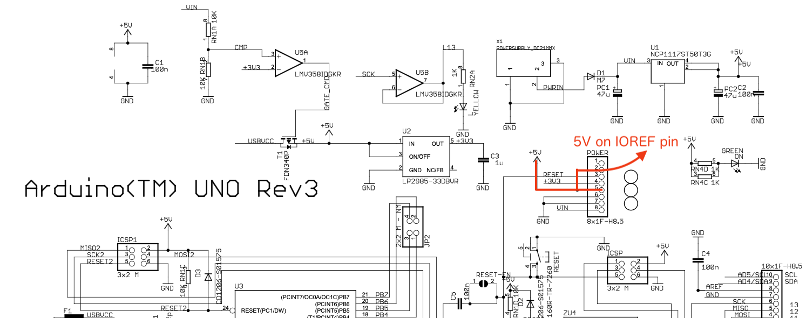

# AFE_NXP_Arduino
Analog Front End device operation sample code for [Arduino](https://www.arduino.cc) 

## What is this?
An Arduino library for NXP Analog Front End device with sample code.  
This library provides simple API to get analog input channels.  
Include device name header file (`NAFE13388.h`) to use those class libraries. 

With `AFE_NXP_Arduino` library, characters can be shown by next sample code. 

> **Note**  
> Current version of NAFE13388_UIM class and its sample code is supporting Arduino **UNO R3**, **UNO R4 Minima** and **UNO R4 WiFi**. 

> **Note**  
> For proper voltage signal interfacing, connection between Arduino MCU board and NAFE13388-UIM board need to be modified. **Remove 3.3V supply pin** to let UIM to support 5V signaling.   
>   
> _3.3V supply pin is lifted at pin extender_  
> 
>   
> _Diagram of 3.3V and 5V supply rails on NAFE13388-UIM board's schematic_
> 
>   
> Using 5V supply on IOREF pin from Arduino board_

```cpp
#include <NAFE13388_UIM.h>

NAFE13388_UIM afe;

void setup() {
  Serial.begin(115200);
  Serial.println("\n***** Hello, NAFE13388! *****");

  SPI.begin();

  afe.begin();
  afe.blink_leds();

  afe.logical_channel[0].configure(0x1710, 0x00A4, 0xBC00, 0x0000);
  afe.logical_channel[1].configure(0x2710, 0x00A4, 0xBC00, 0x0000);

  Serial.println("\nlogical channel 0 (AI1P-GND) and 1 (AI2P-GND) voltages are shown in ADC readout value [V]");
}

void loop() {
  Serial.print((NAFE13388_UIM::microvolt_t)afe.logical_channel[0] * 1e-6);
  Serial.print(",  ");
  Serial.println((NAFE13388_UIM::microvolt_t)afe.logical_channel[1] * 1e-6);
}
```

  
_NAFE13388-UIM 8 Channels Universal Input AFE Evaluation Board with Arduino UNO R3_

  
_For the UIM board, 3.3V pin need to be unconnected to let the boards have correct signaling voltage level_

  
_NAFExx388-EVB 8 Channels Universal Input AFE Evaluation Board with Arduino UNO R3_


*Analog-Front-End chip: NAFE13388*


## Supported device
Type#|Features|Interface
---|---|---
[NAFE13388](https://www.nxp.com/products/peripherals-and-logic/signal-chain/analog-front-end/highly-configurable-8-channel-25-v-universal-input-low-power-analog-front-end:NAFEx1388)	|Highly Configurable 8 Channel ±25 V Universal Input Low Power Analog Front-End	|SPI (mode1)
[NAFE73388](https://www.nxp.com/products/peripherals-and-logic/signal-chain/analog-front-end/highly-configurable-8-channel-25-v-universal-input-low-power-analog-front-end:NAFEx1388)	|Highly Configurable 8 Channel ±25 V Universal Input Low Power Analog Front-End	|SPI (mode1)

## Evaluation boards
Name|Header file|Features|Interface|Evaluation board
---|---|---|---|---
[NAFExx388-EVB](https://www.nxp.com/design/design-center/development-boards-and-designs/NAFExx388-EVB)	|`NAFE13388.h`	|	General purpose evaluation board for NAFE13388 |SPI (mode1)	|[NAFE13388-UIM 8-Channel Universal Input AFE Arduino® Shield Board](https://www.nxp.com/design/design-center/development-boards-and-designs/NAFExx388-EVB)
[NAFE13388_UIM](https://www.nxp.com/products/peripherals-and-logic/signal-chain/analog-front-end/highly-configurable-8-channel-25-v-universal-input-low-power-analog-front-end:NAFEx1388)	|`NAFE13388_UIM.h`	|AFE Arduino shield type evaluation board |SPI (mode1)	|[NAFE13388-UIM 8-Channel Universal Input AFE Arduino® Shield Board](https://www.nxp.com/design/design-center/development-boards-and-designs/NAFE13388-UIM)

# Getting started
How to setup? --> [https://youtu.be/UEOFC0TwA6c](https://youtu.be/UEOFC0TwA6c)  
 

# What's inside?

## Examples
Examples are provided as scketch files.

### How to use?

After library install, Choose menu on Arduino-IDE: `File`→`Examples`→`AFE_NXP_Arduino`→ **sketch for your try**

### List of sample code

Sketch|Target|Feature|NOTE
---|---|---|---
1_0_NAFE13388_simple_SCSR				                  |NAFE13388-UIM	|**Simple** sample to get 2ch inputs|
1_1_NAFE13388_simple_SCSR_using_DRDY_signal|NAFE13388-UIM	|**Simple** sample to get 2ch inputs using DRDY signal|Need to short pins between D2 and D4
2_0_NAFE13388_multichannel_read_MCMR|NAFE13388-UIM	|Get 8ch inputs using Multi-Channel Multi-Read command| 
2_1_NAFE13388_multichannel_read_MCMR_using_DRDY|NAFE13388-UIM		|Get 8ch inputs using Multi-Channel Multi-Read command| Need to short pins between D2 and D4
3_0_NAFE13388_multichannel_read_MCCR_using_DRDY|NAFE13388-UIM	|Get 8ch inputs using Multi-Channel **Continuous**-Read command| Need to short pins between D2 and D4
4_0_NAFE13388_LVMUX_multichannel_read_MCCR_using_DRDY|NAFE13388-UIM	|Get 8ch inputs and LVMUX inputs (supply voltage, etc)|Need to short pins between D2 and D4
9_0_NAFE13388_UIM_self_calibration	|NAFE13388-UIM	|A sample of performing **self calibration** on UIM board


# Document
For details of the library, please find descriptions in [this document](https://teddokano.github.io/AFE_NXP_Arduino/annotated.html).
