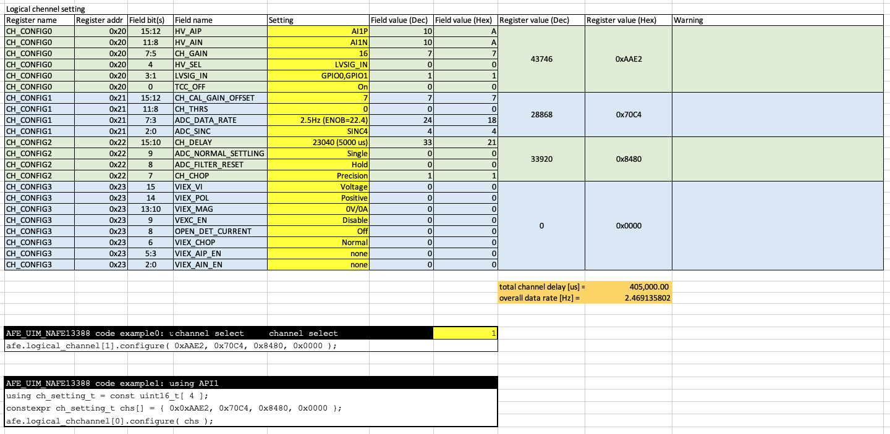

# 6_0_NAFE13388_Thermocouple

https://github.com/teddokano/AFE_NXP_Arduino/tree/main/examples/6_0_NAFE13388_Thermocouple

Practical sample to measure temperature by thermocouple with on-board RTD.  
The thermocouple measured temperature is conpensated by RTD on GPIO0-GPIO1 pins.  

This sample uses 2 logical channels for thermocouple and RTD.  

## Wiring

## Logical channel setting on channel 0

## Logical channel setting on channel 1

