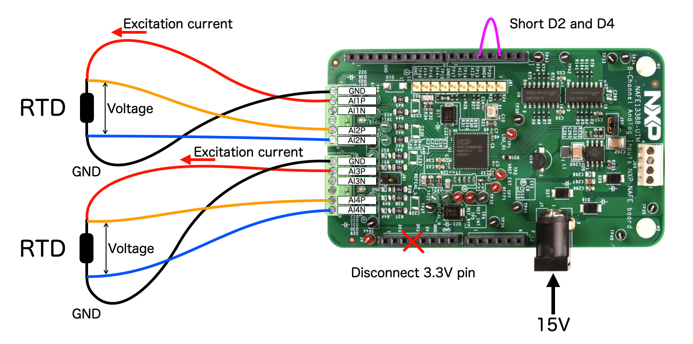

# 5_0_NAFE13388_RTD_4_wire

Practical sample to measure temperature by 2 RTDs using internal current excitation source.  
These RTD measurements are done in 4 wire method.  

This sample uses 2 logical channels for each RTDs.  
The logical channel setting defines analog input channel selections as well as excitation current configurations.  

## Wiring

## Logical channel setting on channel 0

## Logical channel setting on channel 1

