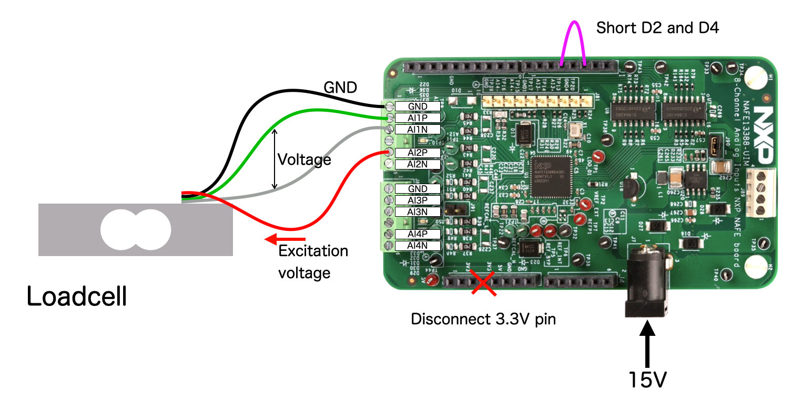
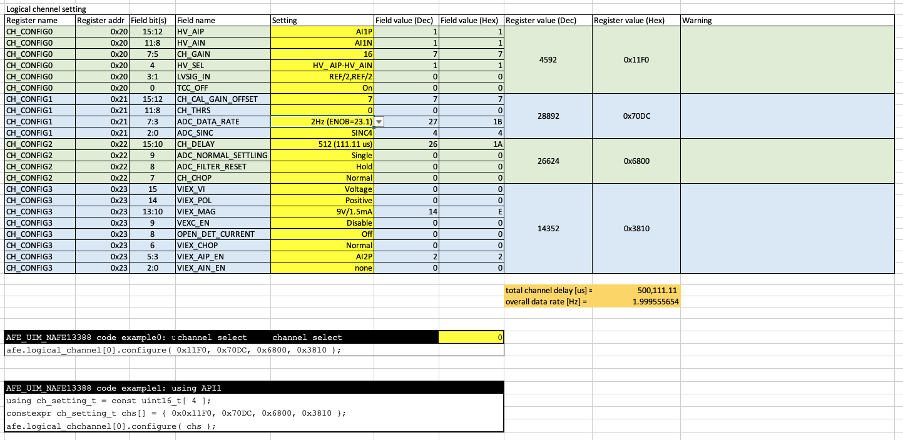

# 7_0_NAFE13388_LoadCell

Practical sample to measure loadcell output using internal voltage excitation source.   

This sample uses 1 logical channel.  
The logical channel setting defines analog input channel selections as well as excitation current configurations.  

## Wiring

## Logical channel setting on channel 0

